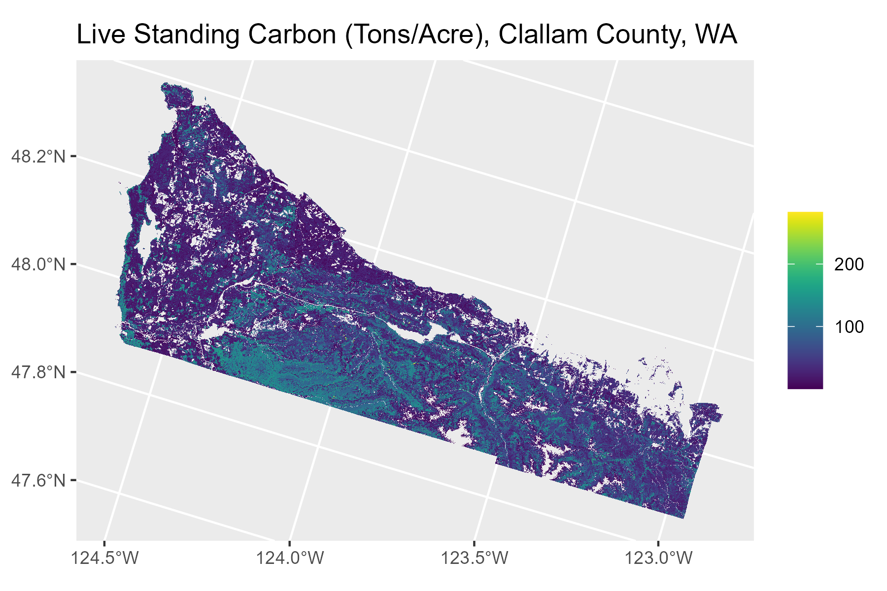
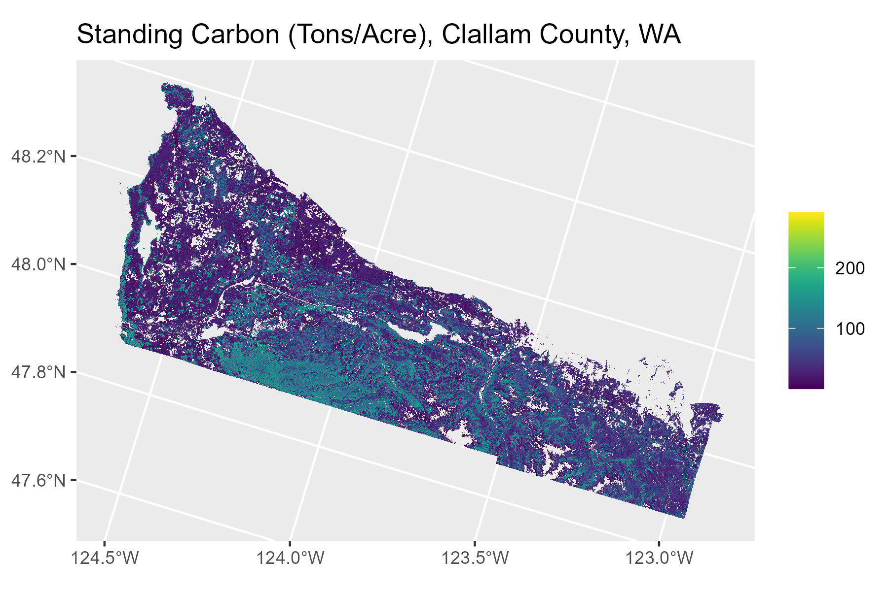
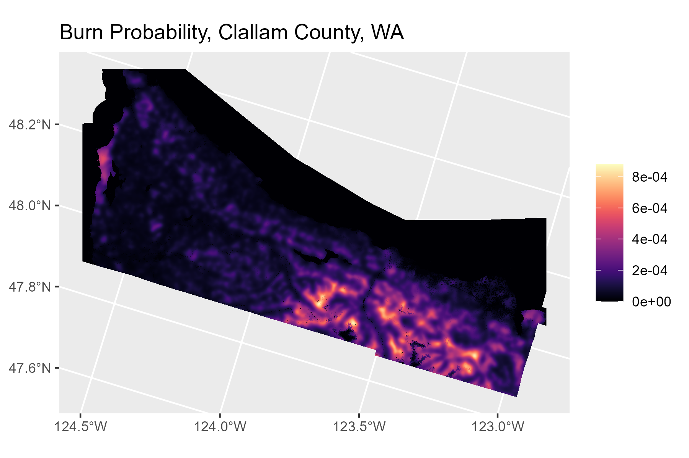

# FNCAP \| TreeMap Demo


# Objectives

This document tries out a basic workflow for TreeMap data.

Specific objectives are:

1.  Check out geospatial microdata in TreeMap.
2.  Try simple raster operations with TreeMap.
3.  Try raster operations with TreeMap and a wildfire dataset (FSIM BP,
    just for fun).
4.  Try joining FIA microdata onto the TreeMap raster.
5.  Set up a time series of microdata describing stand growth and
    wildfire probabilities.

(1)-(3) went well, and results are shown in this document. (4) is
complex and not at all done.

# Results Preview

- TreeMap works as advertised.

- For now, the geospatial package “terra” in R is great for handling
  rasters locally.

- FSIM BP is neat, if unhelpful for shifting into a time series
  approach.

  - The workflow for incorporating other fire data should be the same as
    for FSIM.

# Results

## 1. Data

We can start by reading in TreeMap and glancing at the more interesting
files.

The data structure isn’t straightforward to parse, and terra confuses
things a little.

``` r
# Get TreeMap data and check their structure.

#  Get a raster.

dat_raster = "data/TreeMap/TreeMap2016.tif" %>% rast

dat_raster
```

    class       : SpatRaster 
    dimensions  : 97383, 154221, 1  (nrow, ncol, nlyr)
    resolution  : 30, 30  (x, y)
    extent      : -2362845, 2263785, 259065, 3180555  (xmin, xmax, ymin, ymax)
    coord. ref. : NAD_1983_Albers 
    source      : TreeMap2016.tif 
    categories  : CN, FORTYPCD, ForTypName, FLDTYPCD, FldTypName, STDSZCD, FLDSZCD, BALIVE, CANOPYPCT, STANDHT, ALSTK, GSSTK, QMD_RMRS, SDIPCT_RMR, TPA_LIVE, TPA_DEAD, VOLCFNET_L, VOLCFNET_D, VOLBFNET_L, DRYBIO_L, DRYBIO_D, CARBON_L, CARBON_D, CARBON_DWN, tm_id 
    name        :              CN 
    min value   : 175742190010854 
    max value   :  40407804010690 

``` r
#  Get a table.

dat_table = "data/TreeMap/Treemap2016_tree_table.csv" %>% read_csv
```

    Rows: 2076390 Columns: 15
    ── Column specification ────────────────────────────────────────────────────────
    Delimiter: ","
    chr  (3): COMMON_NAME, SCIENTIFIC_NAME, SPECIES_SYMBOL
    dbl (12): tm_id, CN, STATUSCD, TPA_UNADJ, SPCD, DIA, HT, ACTUALHT, CR, SUBP,...

    ℹ Use `spec()` to retrieve the full column specification for this data.
    ℹ Specify the column types or set `show_col_types = FALSE` to quiet this message.

``` r
dat_table %>% head
```

    # A tibble: 6 × 15
      tm_id      CN STATUSCD TPA_UNADJ  SPCD COMMON_NAME   SCIENTIFIC_NAME        
      <dbl>   <dbl>    <dbl>     <dbl> <dbl> <chr>         <chr>                  
    1   746 1.40e14        1      6.02   131 loblolly pine Pinus taeda            
    2   746 1.40e14        1      6.02   131 loblolly pine Pinus taeda            
    3   746 1.40e14        1      6.02   131 loblolly pine Pinus taeda            
    4   746 1.40e14        1      6.02   131 loblolly pine Pinus taeda            
    5   746 1.40e14        1     75.0    611 sweetgum      Liquidambar styraciflua
    6   746 1.40e14        1      6.02   131 loblolly pine Pinus taeda            
    # ℹ 8 more variables: SPECIES_SYMBOL <chr>, DIA <dbl>, HT <dbl>,
    #   ACTUALHT <dbl>, CR <dbl>, SUBP <dbl>, TREE <dbl>, AGENTCD <dbl>

``` r
# Get raster attribute table for reference.

dat_raster_categories = cats(dat_raster)[[1]] %>% as_tibble

dat_raster_categories %>% head
```

    # A tibble: 6 × 26
      Value CN        FORTYPCD ForTypName FLDTYPCD FldTypName STDSZCD FLDSZCD BALIVE
      <int> <chr>        <int> <chr>         <int> <chr>        <int>   <int>  <dbl>
    1     1 17574219…      161 Loblolly …      161 Loblolly …       2       2  135. 
    2     4 26415970…      520 Mixed upl…      406 Loblolly …       3       1   42.3
    3     6 17574219…      602 Sweetgum …      602 Sweetgum …       2       2   71.4
    4     7 26416009…      520 Mixed upl…      520 Mixed upl…       1       3  153. 
    5     8 33544573…      161 Loblolly …      161 Loblolly …       2       2  163. 
    6     9 38610554…      520 Mixed upl…      503 White oak…       2       2   33.6
    # ℹ 17 more variables: CANOPYPCT <int>, STANDHT <int>, ALSTK <dbl>,
    #   GSSTK <dbl>, QMD_RMRS <dbl>, SDIPCT_RMR <dbl>, TPA_LIVE <dbl>,
    #   TPA_DEAD <dbl>, VOLCFNET_L <dbl>, VOLCFNET_D <dbl>, VOLBFNET_L <dbl>,
    #   DRYBIO_L <dbl>, DRYBIO_D <dbl>, CARBON_L <dbl>, CARBON_D <dbl>,
    #   CARBON_DWN <dbl>, tm_id <int>

## 2. Geospatial Processing and Visualization

### a. TreeMap

With TreeMap in hand, we can check whether terra and TreeMap deliver
what we might expect for a spatial subset that preserves some
interesting detail while reducing processing time. I picked Clallam
County, WA. I also picked CARBON_L for a quick visualization, which is
estimated carbon in living trees.

``` r
# Get administrative boundaries to reduce to CA, OR, WA.
dat_boundaries = 
  "data/Admin/S_USA.ALPGeopoliticalUnit.gdb" %>% 
  vect %>% 
  subset(STATENAME == "Washington" & NAME == "Clallam", NSE = TRUE) %>% # STATENAME == "California" | STATENAME == "Oregon" | 
  aggregate %>% 
  project(dat_raster %>% crs) %>% 
  rasterize(crop(dat_raster, .))

# Crop TreeMap.
dat_crop = 
  dat_raster %>% 
  crop(dat_boundaries) %>% 
  mask(dat_boundaries) %>% 
  trim

# Get a cell attribute onto a plot.

dat_carbon_live = dat_crop

activeCat(dat_carbon_live) = 23

dat_carbon_live = dat_carbon_live %>% as.numeric

# dat_carbon_live %>% plot

vis_carbon_live =  
  ggplot() + 
  geom_spatraster(data = dat_carbon_live,
                  maxcell = Inf) +
  scale_fill_viridis(na.value = NA) +
  labs(title = "Live Standing Carbon (Tons/Acre), Clallam County, WA") +
  theme(legend.title = element_blank())

ggsave("out/vis_carbon_live.png",
       vis_carbon_live,
       dpi = 300,
       width = 6,
       height = 4,
       bg = "transparent")
```



So, initial success: this is what TreeMap should look like, and the
spatial processing is fine at a glance.

Then the next step is to test whether an operation on two TreeMap
rasters will return a useful output. To stick with the carbon example, I
picked CARBON_D, which is estimated carbon in standing dead trees, to
add to the previous result. It’s worth noting that creating another
raster from TreeMap requires no additional memory allocation up front.

### b. Raster Arithmetic with TreeMap

``` r
# Get two cell attributes into a raster arithmetic operation, then onto a plot.

dat_carbon_dead = dat_crop

activeCat(dat_carbon_dead) = 24

dat_carbon_dead = dat_carbon_dead %>% as.numeric %>% subst(-99, 0) %>% subst(NA, 0) # Assume NAs are zeros, just for fun.

dat_carbon_standing = dat_carbon_live + dat_carbon_dead

vis_carbon_standing = 
  ggplot() + 
  geom_spatraster(data = dat_carbon_standing,
                  maxcell = Inf) +
  scale_fill_viridis(na.value = NA) +
  labs(title = "Standing Carbon (Tons/Acre), Clallam County, WA") +
  theme(legend.title = element_blank())

ggsave("out/vis_carbon_standing.png",
       vis_carbon_standing,
       dpi = 300,
       width = 6,
       height = 4,
       bg = "transparent")
```

 This isn’t a
thrilling departure from live carbon, but the distribution over space
shifts a bit higher. Point being, raster arithmetic works fine with
terra and TreeMap.

The next step is to pull in a different dataset, in particular a
representative raster of wildfire risk, to test whether the same
workflow is useful for another geospatial product that we’ll need. I
used burn probabilities (BP) from FSIM. The data description led me to
believe these are burn probabilities for 2020, but I haven’t
double-checked; in any case, this is really just stand-in fire data.

### c. FSIM onto TreeMap

``` r
# Get a fire raster onto the TreeMap raster and into a plot. 

dat_burn = 
  "data/FSIM/WA/BP_WA.tif" %>% 
  rast %>% 
  project(dat_raster %>% crs) %>% 
  crop(dat_boundaries) %>% 
  mask(dat_boundaries) %>% 
  trim %>% 
  resample(dat_carbon_standing)
```


    |---------|---------|---------|---------|
    =========================================
                                              

``` r
vis_burn = 
  ggplot() + 
  geom_spatraster(data = dat_burn,
                  maxcell = Inf) +
  scale_fill_viridis(option = "magma",
                     na.value = NA) +
  labs(title = "Burn Probability, Clallam County, WA") +
  theme(legend.title = element_blank())

ggsave("out/vis_burn.png",
       vis_burn,
       width = 6,
       height = 4,
       bg = "transparent")
```



Without looking into differences at the edges of the Clallam County
mask, FSIM data come through the terra workflow just as well as TreeMap
data, and reconciling the two rasters to the same spatial definition
doesn’t seem to have created problems. This could be a good time to do
some raster operations with TreeMap and FSIM together, but without doing
more modeling than this exercise really warrants, I don’t know what
operation would be meaningful or interesting; this would also duplicate
the previous step.

Instead, I’ll proceed to pull a couple of spatial statistics out of a
combined TreeMap and FSIM raster.

### d. Spatial Statistics with TreeMap and FSIM

``` r
# Get a fire raster and a TreeMap cell attribute into a raster statistical operation (try covariance and correlation).

dat_carbon_burn = c(dat_carbon_standing, dat_burn)

dat_carbon_burn_cov = dat_carbon_burn %>% layerCor("cov", asSample = FALSE, use = "complete.obs")
dat_carbon_burn_cor = dat_carbon_burn %>% layerCor("cor", asSample = FALSE, use = "complete.obs")

dat_carbon_burn_cov$covariance[2, 1] 
```

    [1] 0.000153115

``` r
dat_carbon_burn_cor$correlation[2, 1] 
```

    [1] 0.08334716

``` r
# Unfinished steps:
# Get FIA data from outside of TreeMap, crosswalk it to TreeMap ID by CN, and get it onto a plot. 
# Get data out of raster format to demo simpler manipulation once geospatial steps are sorted.
# Extend prior steps to a panel of FIA data.
```

These numbers are, respectively, covariance and correlation of tons of
standing carbon per acre (c.2016) with annual burn probabilities
(c.2020). That doesn’t mean a whole lot, but the point is that this
workflow from TreeMap and a representative fire dataset is good for data
processing, raster operations, and spatial statistics.

## 3. Discussion

The next step is to pull in additional FIA data, first just to crosswalk
the full FIA dataset to TreeMap’s spatial definitions, then to put
together a time series to support growth models. The hurdle to this is
understanding TreeMap’s approach to CN, i.e. to unique identifiers
within FIA data. That’s manageable, but might have implications for the
time series approach, in that TreeMap might impose limits on a time
series from FIA. Then the data management for a spatially explicit time
series is a different beast altogether. This doesn’t touch on
outstanding questions around fire data selection and modeling.
